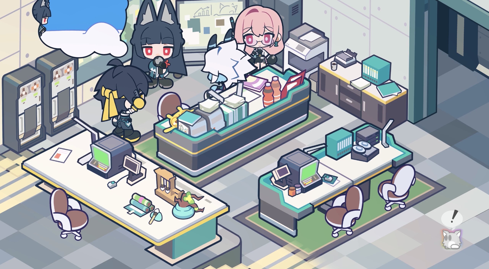
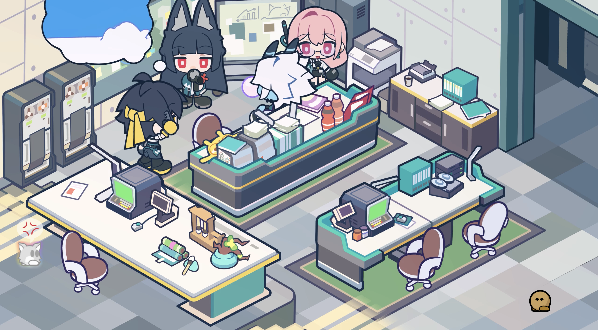
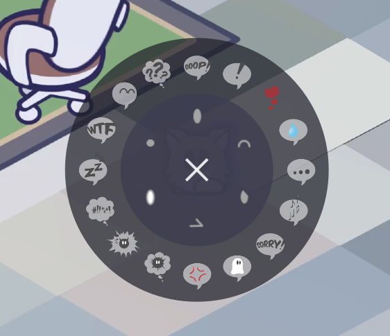
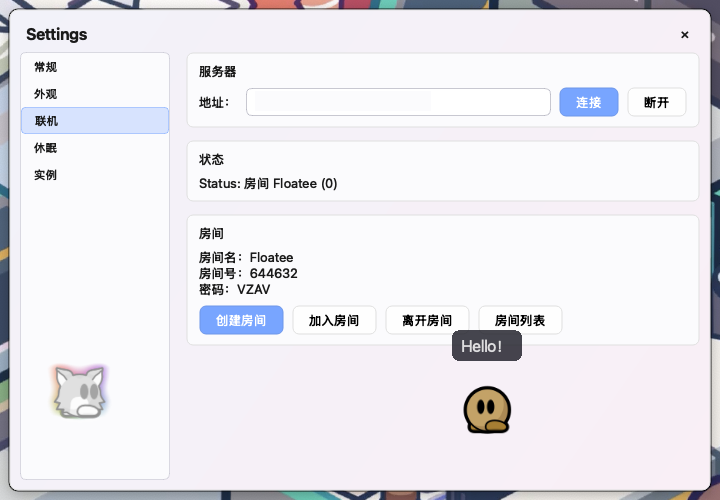
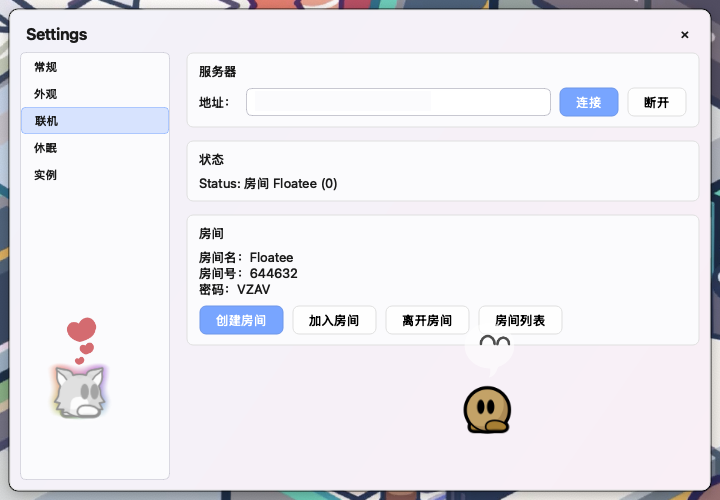
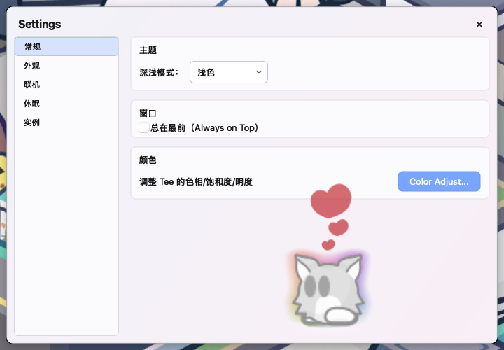
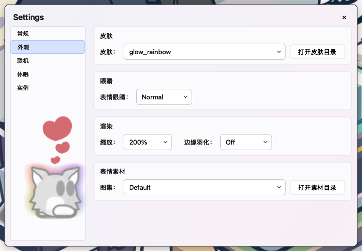

# Floatee

<p align="center">
  一个浮动在屏幕上的桌面宠物，支持实时联机。
</p>

> 📄 English version: <a href="README.md">English</a>

## 📝 项目简介

Floatee 是一个桌面伴侣，在桌面之上渲染一个 Tee（来自
DDraceNetwork / Teeworlds 世界）：
- 半透明、置顶的宠物，眼睛跟随光标移动
- 丰富交互：**表情圆盘**、聊天气泡、走路动画、任意 Tee 拖拽/缩放
- **实时联机**：运行中转服务器（或使用公共服务器），创建房间后即可看到
  朋友的 Tee —— 同步眼睛、皮肤、表情、HSL 配色与聊天

渲染管线移植自 DDNet 的 `tee_render`，表情圆盘交互参考 QMClient 的 `CEmoticon`。

## ✨ 功能

### 单机
- 浮动半透明宠物（全屏画布，不遮挡桌面操作）
- 光标驱动的眼睛跟随（距离相关滑动）
- 表情圆盘（16 表情 + 6 眼睛），带弹出 / 收回动画
- 可自定义**皮肤**与**表情素材**（4×4 图集 PNG）
- 每皮肤 HSL 调色、缩放（50–200%）、羽化
- 拖拽走路动画
- 极简现代 UI（半透明圆角菜单 / 弹窗 / 输入框）

### 联机
- 房间系统（6 位数字房间号 + 4 位邀请码）
- 互相显示对方的 Tee（本地可拖拽 / 缩放）
- 同步眼睛（视线方向）、皮肤（缺失自动回落 default）、HSL 配色、
  表情（实时广播）与聊天气泡
- 远端 Tee 右键菜单：隐藏 / 重置 / 踢出（仅房主）
- 从 DDNet 皮肤库自动下载远端皮肤（计划中）
- Node.js 中转服务器：房间管理 / 限流 / admin API

### 设置与 UI
- **设置窗口**：5 页布局（常规、外观、联机、休眠、实例）
  - 深浅主题切换（跟随系统或手动）
  - 缩放比例、服务器状态、使用时长实时同步
  - 房间信息显示（创建/加入/离开/列表按钮）
- **主题系统**：Fluent 风格设计，半透明玻璃质感
- **使用时长统计**：累计使用时间，支持休息提醒
- **重置位置**：多屏幕支持，找回丢失的宠物

## ❤️ 贡献者

感谢所有为本项目提交代码、反馈问题与提出改进的贡献者。

## 🚀 构建

### 依赖
- CMake ≥ 3.16
- Qt 6.5+（Core、Gui、Widgets、Network）
- C++17 编译器（MSVC 2019/2022、MinGW、GCC、Clang）

### Windows
```bat
cmake -S . -B build
cmake --build build --config Release
:: 输出：build\Release\Floatee.exe
```

### macOS / Linux
```sh
cmake -S . -B build
cmake --build build -j
```

### macOS Release 构建
```sh
mkdir build_release && cd build_release
cmake .. -DCMAKE_BUILD_TYPE=Release -DCMAKE_OSX_DEPLOYMENT_TARGET=12.0
cmake --build . -j 8
macdeployqt Floatee.app -qmldir=. -verbose=1
codesign --force --deep --sign - Floatee.app
```
输出：`build_release/Floatee.app`（可直接分发）

### 运行联机服务器
```sh
cd server
npm install
npm start        # TCP 8764 / WS 9001 / Admin 8766
```
部署详见 [server/DEPLOYMENT.md](server/DEPLOYMENT.md)。

## ✅ 测试

### 服务器
```sh
cd server
npm test         # node --test（19 个用例）
```

### 客户端
构建并启动 `Floatee`，右键托盘图标探索菜单。

## 🖼 截图

<p align="center">
  
  
</p>

<p align="center">
  
  
  
</p>

<p align="center">
  
  
</p>

1. **主界面**：Tee 浮动在桌面上，眼睛跟随光标移动
2. **多人模式**：多个 Tee 在同一房间（同步眼睛/皮肤/聊天）
3. **表情圆盘**：16 个表情 + 6 种眼睛，带弹出动画
4. **联机页面**：服务器连接、房间信息、房间操作按钮
5. **联机 + 表情**：多人模式下的表情圆盘
6. **设置 - 常规页**：主题切换、窗口设置
7. **设置 - 外观页**：皮肤选择、眼睛/缩放/羽化控件

## 🏛 致谢

- **DDNet / Teeworlds** —— Tee 渲染管线（`tee_render`）与皮肤数据库来自
  DDraceNetwork 项目
- **QMClient** —— 表情圆盘交互参考
- **Qt Project** —— Qt 6 框架（LGPL）
- **ElaWidgetTools** —— UI 设计参考（Fluent 风格）

## 📜 许可

本项目基于 / 参考 DDNet 与 QMClient。由于渲染管线与交互代码衍生自 GPL-3.0
项目，本项目以 **GNU General Public License v3.0** 发布。

Qt 以动态链接方式按 **LGPL-3.0** 使用。

详见根目录 [LICENSE](LICENSE) 与 [THIRD_PARTY_NOTICES.txt](THIRD_PARTY_NOTICES.txt)。

## 📮 备注

本项目是个人化的桌面宠物，**不是** DDNet 或 QMClient 的官方产品。皮肤素材
版权归各自作者所有，请遵循各素材的许可（如 DDNet 皮肤库的 CC BY-SA）。
